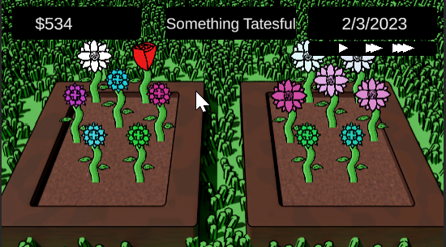
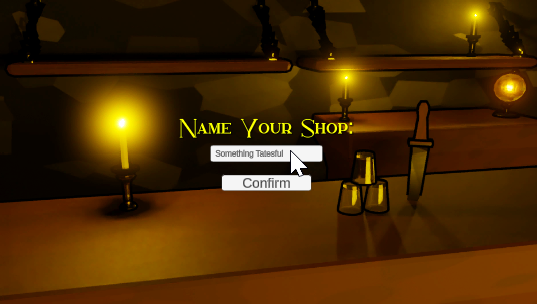
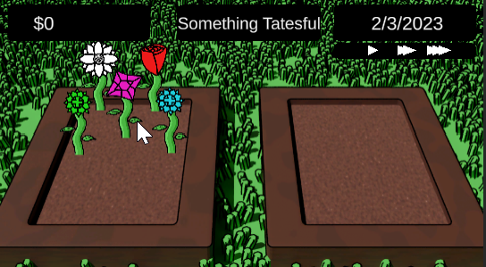
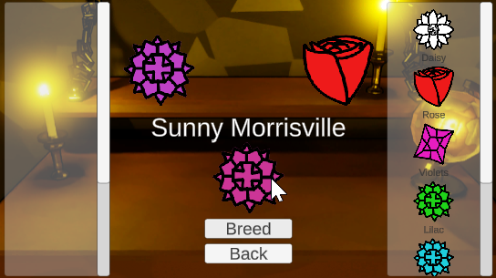
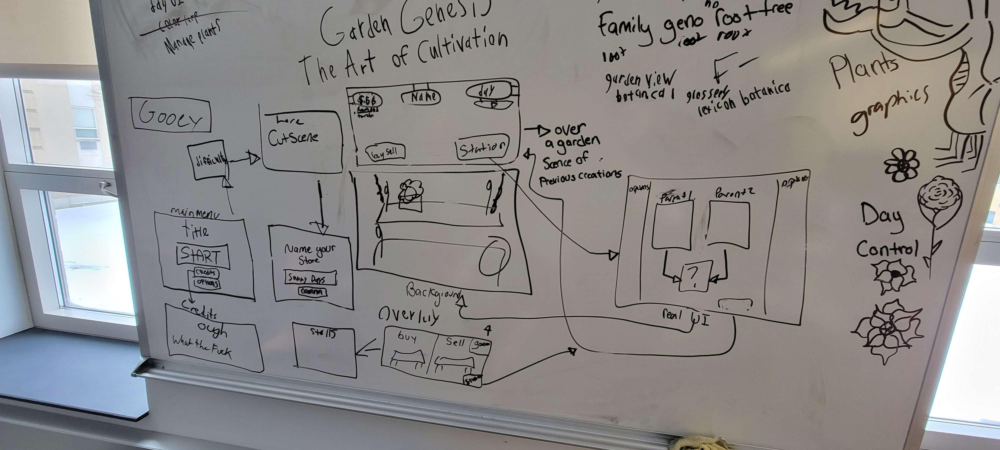

# Project Info
- <a href="https://github.com/Aleph-Null-Studios/Garden-Genesis-The-Art-of-Cultivation" target="_blank">Click Here</a> for a look at the repository.
- <a href="https://dabvexx.itch.io/garden-genesis-the-art-of-cultivation" target="_blank">Click Here</a> to play the game in your browser.

## Credits:
### - Programmers:
- Alex Woods (Me!)
- Caleb Brazeau
- Chino Beach

### - 2D Artists:
- Connor Courtoies

### - 3D Modeler:
- Grace Fowler

### Screenshots:

    
    
    
    
    

---

# What is Garden Genesis: The Art of Cultivation?

"Garden Genesis: The Art of Cultivation," or Garden Genesis as I shall refer to it for the rest of this blog, is the submission I and a few of my friends created for Global Game Jam '23. The theme for this game jam was "Roots," which can be interpreted as many different things. A few projects I saw while playing a few of the games from the jam had the idea of family heritage, the creation of culture, and plants. 

The game consists of growing plants and breeding them together to get new colors and flowers of plants that will sell for more. The goal is to get $20,000 by selling points to beat the game.

The game takes about 20 minutes to beat, and the people who played said that it felt like a short and sweet time waster.

---

# Game Concept

My immediate idea for this theme was a type of Botony plant breeding sim in which you breed plants together, combining attributes of the parent plants, such as color and flower shape, and producing an entirely new plant. During the development, Chino suggested adding a story about running your family's old plant stand after leaving a tedius office job. This story and concept create two meanings for the theme root, the roots of a plant and returning to one's roots.

---

# Execution

This was the first project I've ever worked on as a team with a group collaborating through GitHub. We created a organization in order to do the project (you can see our other projects through the organization!). It was a little tough as the two artists had never touched GitHub before this point, and we spent atleast an hour guiding them through the process.

As three programmers, we found conceptualizing the programming to be challenging. We eventually realized that the ideal approach was to create a theoretical system of plant objects that solely represent the data, without also handling game logic and rendering.

An interesting point about this game is the opening cutscene. AI entirely created the opening cutscene story and voiceover. [ChatGPT](https://openai.com/blog/chatgpt) wrote the story based on a few prompts (It even generated the name itself by combining two of its responses). [ElevenLabs](https://beta.elevenlabs.io) Speech Synthesis AI did the dramatic reading.

We had to go and plan multiple times through the process, completely filling two whiteboards at least eight times. 

## Here are a few photos of said whiteboard planning:

    
    
    

Needless to say, it was quite hectic and chaotic the whole time. Very little sleep was had those two days.

---

# Lessons Learned

This project taught me about collaborating on a project with multiple team members. This was quite hard to do since we had such a limited amount of time that we couldn't have the luxury of constructing a complete plan that covered every edge case. And since only some on our team were developers, we couldn't effectively utilize techniques such as sprints or waterfalls. The end product is decent. However, there certainly are some game mechanics and general polish all of us wish we had time to include.

---

# Summary

Overall, this was a fun and exciting project to do. I got to have fun with my friends while creating an interesting portfolio piece. The story and voice acting being done entirely by AI show the power of AI technology from [OpenAI](https://openai.com) and [ElevenLabs](https://beta.elevenlabs.io). It taught my friends and me just how important a good plan is with the challenges brought by the small time frame. I am eagerly anticipating my next game jam or passion project, eager to tackle the challenges and see what I can create.

---