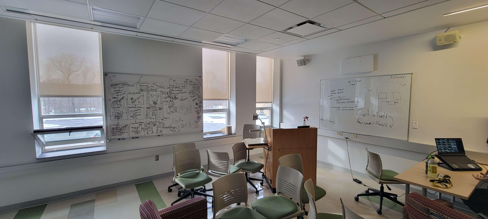

# What is Garden Genesis: The Art of Cultivation?

"Garden Genesis: The Art of Cultivation", or simply Garden Genesis as I shall refer to it for the rest of this blog, is the submission me and a few of my friends created for Global Game Jam '23. The theme for this game jam was "Roots", which could be interperated as many different things. A few projects I saw while playing a few of the game from the jam had the idea of family heritige, the creation of culture, and plants.
 
 
## If you would like some more information on the project:
- <a href="https://github.com/Aleph-Null-Studios/Garden-Genesis-The-Art-of-Cultivation" target="_blank">Click Here</a> for a look at the repository.
- <a href="https://dabvexx.itch.io/garden-genesis-the-art-of-cultivation" target="_blank">Click Here</a> to play the game in your browser.

## Credits:
### - Programmers:
- Alex Woods (Me!)
- Caleb Brazeau
- Chino Beach

### - 2D Artists:
- Connor Courtoies

### - 3D Modeler:
- Grace Fowler

### Screenshots:

    
    
    
    
    

---

# Game Concept

My immediate idea for this theme was a type of botony plant breeding sim in which you breed plants together, which will then combine attributes of the parent plants, such as color and flower shape, and produce an entirely new plant. During the development, Chino suggested adding a story about running your families old plant stand after leaving a boring office job. This creates two meanings for the theme root, the roots of a plant and going back to ones roots.

---

# Execution

This project was the first project I've ever worked on as a team with a group collaborating through GitHub. 

An interesting point about this game is the opening cutscene. The opening cutscene story and voice over was entirely created by AI. [ChatGPT](https://openai.com/blog/chatgpt) wrote the story based on a few prompts (It even generated the name itself from combining 2 of its responses). [ElevenLabs](https://beta.elevenlabs.io) Speech Synthesis AI did the dramatic reading.

We had to go and plan multiple times through the process, completely filling 2 whiteboards at least eight times. 

## Here are a few photos of this development process:

    
    
    

---

# Lessons Learned

This project taught me about collaborating on a project with multiple team members. It was a bit hard to do since we had such a limited amount of time we couldnt construct a full plan that covers every edge case. We had to go and plan multiple times through the process, completely filling 2 whiteboards at least eight times. 

---

# Summery

Overall, this was a fun and interesting project to do. 

---