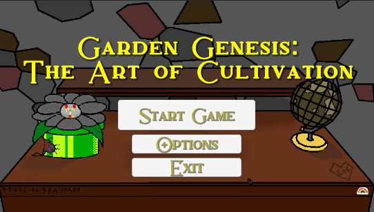

# Project Info
- <a href="https://github.com/Aleph-Null-Studios/Garden-Genesis-The-Art-of-Cultivation" target="_blank">Click Here</a> for a look at the repository.
- <a href="https://dabvexx.itch.io/garden-genesis-the-art-of-cultivation" target="_blank">Click Here</a> to play the game in your browser.

## Credits:
### - Programmers:
- Alex Woods (Me!)
- Caleb Brazeau
- Chino Beach

### - 2D Artists:
- Connor Courtoies

### - 3D Modeler:
- Grace Fowler

### Screenshots:

    
    
    
    
    

---

# What is Garden Genesis: The Art of Cultivation?

"Garden Genesis: The Art of Cultivation", or simply Garden Genesis as I shall refer to it for the rest of this blog, is the submission me and a few of my friends created for Global Game Jam '23. The theme for this game jam was "Roots", which could be interpreted as many different things. A few projects I saw while playing a few of the game from the jam had the idea of family heritige, the creation of culture, and plants. 

The game consists of growing plants, breeding them together to get new colors of and flowers of plants that will sell for more. The goal is to get $20,000 by selling points in order to retire and beat the game.

The game takes about 20 minutes to beat, and the people who played said that it felt like a short and sweet time waster.

---

# Game Concept

My immediate idea for this theme was a type of Botony plant breeding sim in which you breed plants together, which will then combine attributes of the parent plants, such as color and flower shape, and produce an entirely new plant. During the development, Chino suggested adding a story about running your families old plant stand after leaving a boring office job. This creates two meanings for the theme root, the roots of a plant and going back to ones roots.

---

# Execution

This project was the first project I've ever worked on as a team with a group collaborating through GitHub. 

An interesting point about this game is the opening cutscene. The opening cutscene story and voice over was entirely created by AI. [ChatGPT](https://openai.com/blog/chatgpt) wrote the story based on a few prompts (It even generated the name itself from combining 2 of its responses). [ElevenLabs](https://beta.elevenlabs.io) Speech Synthesis AI did the dramatic reading.

We had to go and plan multiple times through the process, completely filling 2 whiteboards at least eight times. 

## Here are a few photos of this:

    
    
    

Needless to say, it was quite hectic and chaotic the whole time. Not much sleep was had those 2 days. :sleepy:

---

# Lessons Learned

This project taught me about collaborating on a project with multiple team members. This was a quite hard to do since we had such a limited amount of time we didn't have the luxury of constructing a full plan that covers every edge case. And since not everyone on our team was a developer either, so we couldn't effectivly utilize techniques such as sprints or waterfalls. The end product is decent, however there certainly is some game mechanics and polish all of us wished we had time to include.

---

# Summary

Overall, this was a fun and interesting project to do. I got to have fun with my friends while creating a interesting portfolio piece. The story and voice acting being done entirely by AI really shows the power of AI technology from [OpenAI](https://openai.com) and [ElevenLabs](https://beta.elevenlabs.io). It taught me and my friends just how important a good plan is with the challenges brought with the small time frame. I can't wait to tackle the next game jam or passion project I do next. 

---