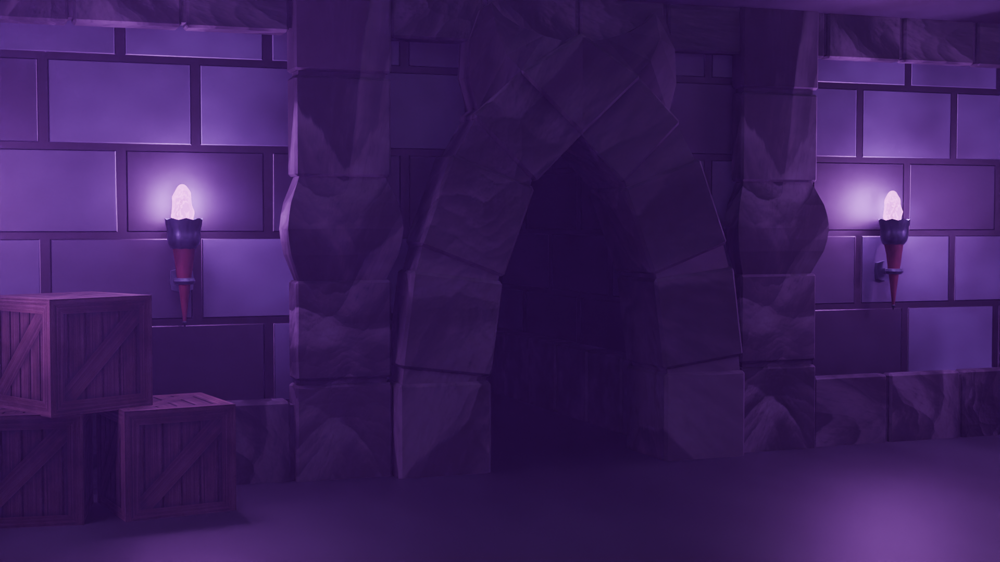
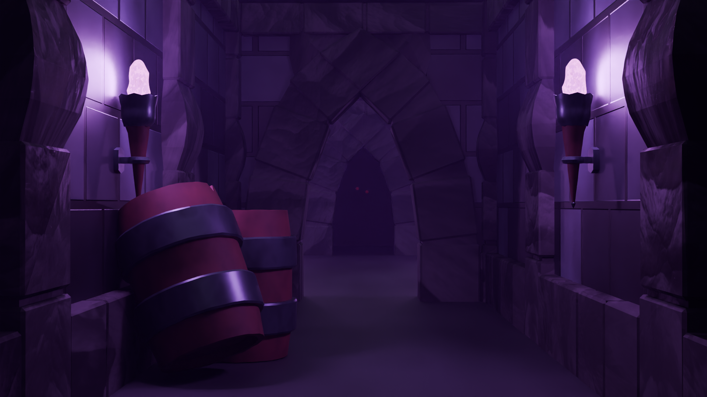
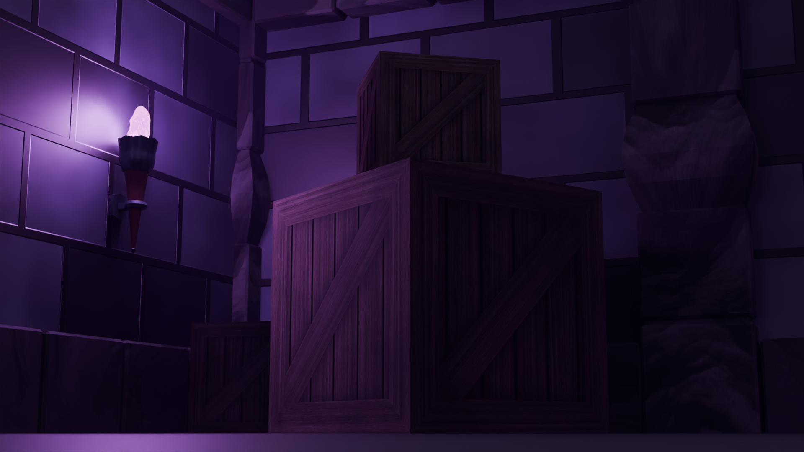

During a 3D modeling class last semester, we were tasked with making a simple dungeon scene. I took this as a challenge to test my 3D modeling skills and go above and beyond the assignment.

# Renders

    
    
    

---

# The Beast

I wanted to tell a story with the renders with this scene. A dungeon deep beneth the earth, ramins of crates and torches imply an old storage room, but mysteriously 
The beast in the door is simply 2 spheres which emit red light.

---

# Lighting & Fog

The main atmosphere of the scene is created with the purple lighting and the dense fog. 

---

# Torches

The thing im most proud of in this scene are the torches, they are animated beautifully and look gorgeous. The way it was done was by.
