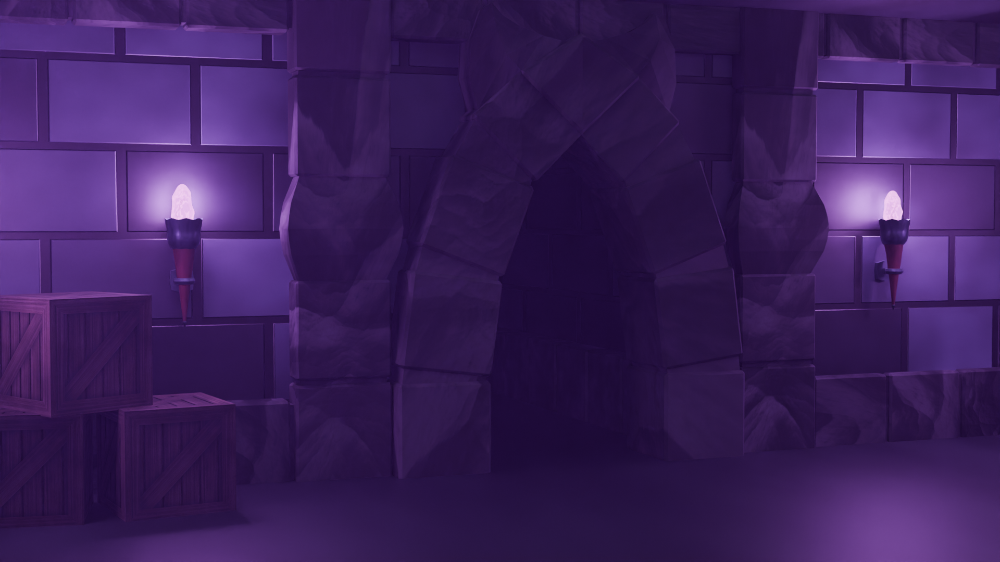
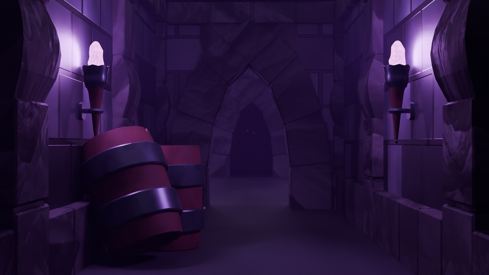
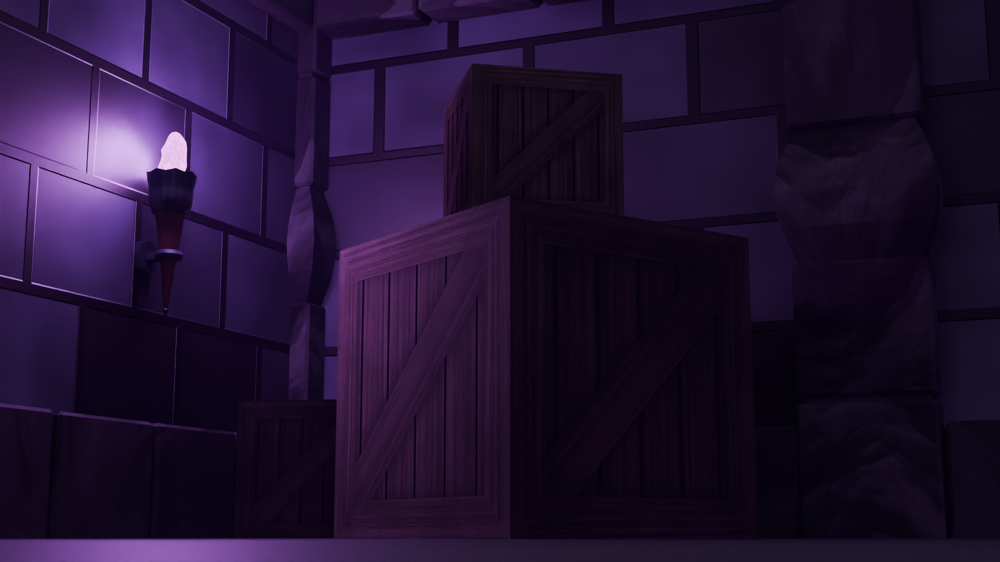

During a 3D modeling class last semester, we were tasked with making a simple dungeon scene. I took this as a challenge to test my 3D modeling skills and go above and beyond the assignment.

# Renders

    
    
    

---

# The Beast

I wanted to tell a story with the renders with this scene. A dungeon deep beneth the earth, ramins of crates and torches imply an old storage room, but mysteriously 
The beast in the door is simply 2 spheres which emit red light.

---

# Lighting & Fog

The main atmosphere of the scene is created with the purple lighting and the dense fog. The purple light from the torch adds to that unnatural feeling, while looking beautiful at the same time. The dark fog that engulfs the room also adds to the threatening aura of the eges in the darkness.

---

# Torches

The thing im most proud of in this scene are the torches, they are animated beautifully and look gorgeous. The way it was done was by deforming a mesh, layering that mesh, and adding shaders to it.

    <video width="720" height="480" controls>
    <source src="../assets/videos/torch.mp4" type="video/mp4">
    Your browser does not support the video tag.
    </video> 

The design is very cartoony in nature and I love the aesthetic of it.